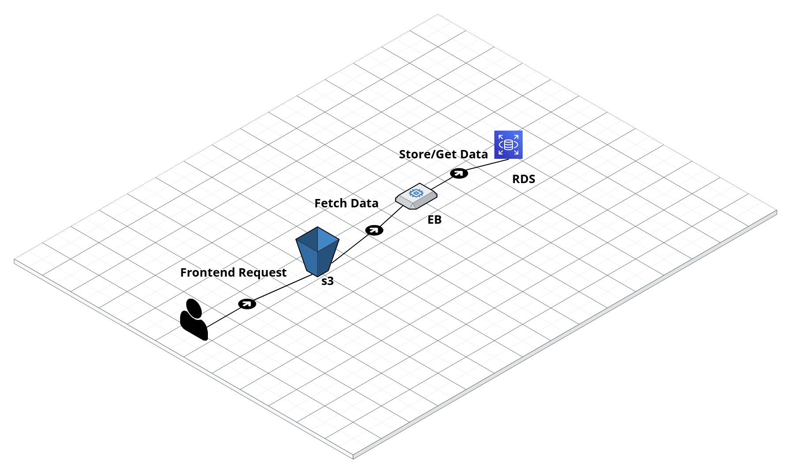

# Infrastructure

## App Services

What Udagarm needs Aws services to run?

-  Simple Storage Service (S3)
-  Database Service (RDS)
-  Elasticbeanstalk (EB)

## AWS Hook of Udagram App

-  User accesses a URL to get a static website from `S3`
-  Website calls backend through `EB`
-  Backend calls `RDS` to get data from a database
