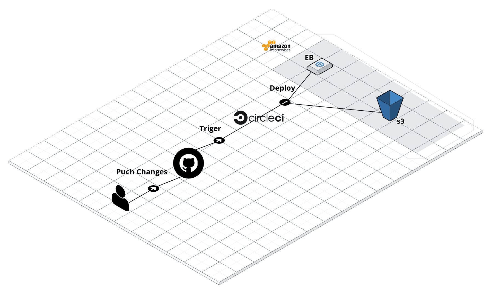

# Pipeline

Pipelines are normally written inside configuration files as a list of steps. In the case of CircleCI, this file will always be located inside a .circleci folder and will be named `config.yml`.

-  User push the code to Github
-  Trigger the pipeline by running `build` and `deploy`
-  Deploy the code to an AWS server whether it's S3, Eb, or both.
